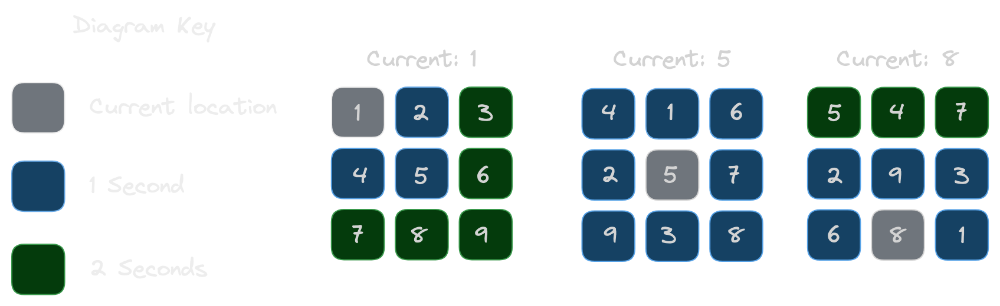

# keyboard

Each day, to enter their building, employees of an e-commerce company have to type a string of numbers into a console using a `3 × 3` numeric keypad.

Every day, the numbers on the keypad are mixed up. Use the following rules to calculate the total amount of time it takes to type a string:

- It takes `O` seconds to move their finger to the first key, and it takes `O` seconds to press the key where their finger is located any number of times.
- They can move their finger from one location to any adjacent key in one second. Adjacent keys include those on a diagonal.
- Moving to a non-adjacent key is done as a series of moves to adjacent keys.

 

## Function Description
Complete the function *entryTime*.

*entryTime* has the following parameter(s):

`s`: the string to type  
`keypad`: a string of **9** digits where each group of **3** digits represents a row on the keypad of the day, in order.

### Returns:
int: integer denoting the minimum amount of time it takes to type the string `s`.